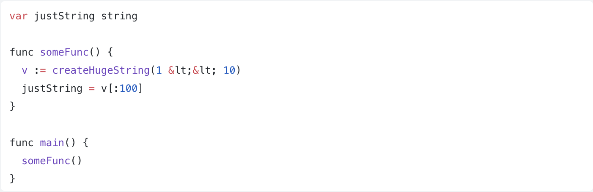

### Небольшой фрагмент кода — проблемы и решение
Рассмотреть следующий код и ответить на вопросы: к каким негативным последствиям он может привести и как это исправить?

Приведите корректный пример реализации.

 Вопрос: что происходит с переменной justString?